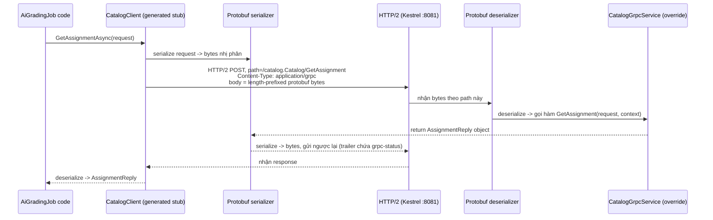

# gRPC từ số 0 — áp vào chính code của bạn

Tài liệu này giải thích gRPC từ khái niệm nền tảng, dùng làm tài liệu thuyết trình cho tính năng
gRPC giữa Grading và Catalog. Mọi ví dụ code đều trích trực tiếp từ repo, không phải code mẫu.

Liên quan: `docs/grpc_manual_test.md` (hướng dẫn test thủ công), `docs/ARCHITECTURE.md`,
`plans/catalog-grading-grpc/plan.md`, `be/src/Services/Catalog/AutoGrading.Catalog.Api/Protos/catalog.proto`.

---

## 1. RPC là gì, và vì sao khác REST

**RPC (Remote Procedure Call)** = gọi một hàm nằm ở máy/tiến trình khác, nhưng viết code *như thể*
nó là hàm local. gRPC (Google, 2015) là bản hiện đại của ý tưởng đó.

So sánh trực tiếp với REST — vì REST là thứ Submission/Notification service trong repo này vẫn
đang dùng:

| | REST | gRPC |
|---|---|---|
| Tư duy | Thao tác trên **tài nguyên**: `GET /assignments/{id}` | Gọi **hàm**: `GetAssignment(id)` |
| Định dạng dữ liệu | JSON — text, người đọc được | Protocol Buffers — nhị phân, máy đọc |
| Giao thức tầng dưới | HTTP/1.1 (thường) | HTTP/2 (bắt buộc) |
| Hợp đồng (contract) | Không bắt buộc — Swagger là tài liệu, không phải luật | File `.proto` — **bắt buộc**, sai kiểu là lỗi biên dịch |
| Sinh code | Không tự động (trừ khi tự generate từ OpenAPI) | Tự động — build là ra client + server stub |

Khi Grading gọi Catalog qua REST (cách cũ), nó gửi:
```
GET http://catalog-api:8080/assignments/a2e9974f-...
```
và tự parse JSON trả về bằng `HttpClient.GetFromJsonAsync<AssignmentDto>()`. Đây là cách "nói
chuyện qua văn bản, hai bên tự hiểu ngầm với nhau".

Với gRPC, hai bên không "ngầm hiểu" — họ cùng đọc chung **một file hợp đồng**.

---

## 2. Protocol Buffers — trái tim của gRPC

File hợp đồng đó là
[`catalog.proto`](../be/src/Services/Catalog/AutoGrading.Catalog.Api/Protos/catalog.proto):

```protobuf
service Catalog {
  rpc GetAssignment (GetAssignmentRequest) returns (AssignmentReply);
  rpc GetCriteriaForAssignment (GetCriteriaForAssignmentRequest) returns (GetCriteriaForAssignmentReply);
  rpc GetLecturerStudentIds (GetLecturerStudentIdsRequest) returns (GetLecturerStudentIdsReply);
}
```

`service` khai báo **những "hàm" nào có thể gọi từ xa** — giống khai báo 1 interface C#. Mỗi `rpc`
là 1 hàm: nhận vào 1 message, trả về 1 message.

```protobuf
message AssignmentReply {
  string id = 1;
  string subject_id = 2;
  string title = 3;
  optional string description = 4;
}
```

`message` là 1 struct dữ liệu. Điểm khác biệt lớn nhất với JSON: **mỗi field có 1 số thứ tự**
(`= 1`, `= 2`...). Số này không phải thứ tự khai báo — nó là "địa chỉ nhị phân" của field khi đóng
gói. Khi Catalog gửi 1 `AssignmentReply`, nó không gửi chữ `"id"` với `"subjectId"` như JSON — nó
gửi thẳng cặp `(số field, giá trị)` dạng nhị phân, ngắn hơn JSON nhiều lần. Đây là lý do các số
field **không được đổi** sau khi đã dùng thật — đổi số là phá vỡ hợp đồng nhị phân với mọi client
cũ.

`optional string description = 4` — proto3 mặc định KHÔNG có khái niệm null (field rỗng và field
không được set trông giống nhau). Từ khoá `optional` sinh thêm 1 cờ `HasDescription` ở code C# để
phân biệt "không có mô tả" với "mô tả rỗng":

```csharp
// CatalogApiClient.cs
return new AssignmentDto(
    Guid.Parse(reply.Id), Guid.Parse(reply.SubjectId), reply.Title,
    reply.HasDescription ? reply.Description : null);
```

**gRPC không có kiểu Guid hay decimal riêng** — proto3 chỉ có các kiểu nguyên thuỷ (`string`,
`int32`, `bool`...). Vì vậy repo này chọn:
- `Guid` → gửi dạng `string` (`assignment_id = 1`), rồi `Guid.Parse` lại ở 2 đầu.
- `decimal` (điểm số) → cũng gửi dạng `string`, **không dùng `double`**, để tránh sai số dấu phẩy
  động khi cộng điểm:

```protobuf
message RubricCriterionReply {
  ...
  // Decimal-as-string (not double) to avoid floating-point drift on grading scores.
  string max_score = 5;
  int32 order_index = 6;
}
```

---

## 3. Từ `.proto` ra code C# thật — code generation

Client và server **không tự viết** `CatalogClient`, `CatalogBase`, `AssignmentReply` — chúng được
**sinh tự động lúc build** bởi `Grpc.Tools`, dựa trên khai báo trong từng `.csproj`:

```xml
<!-- AutoGrading.Catalog.Api.csproj -->
<Protobuf Include="Protos\catalog.proto" GrpcServices="Server" />

<!-- AutoGrading.Grading.Api.csproj -->
<Protobuf Include="..\..\Catalog\AutoGrading.Catalog.Api\Protos\catalog.proto" GrpcServices="Client" />
```

Cùng 1 file `.proto`, nhưng khai báo `GrpcServices` khác nhau ở 2 project → sinh ra 2 loại code
khác nhau:

- **Bên Catalog (`Server`)**: sinh ra `Catalog.CatalogBase` — 1 abstract class với các hàm
  `virtual` (`GetAssignment`, `GetCriteriaForAssignment`...) mặc định throw
  `NotImplementedException`. Việc của Catalog là **kế thừa và override**:

  ```csharp
  // CatalogGrpcService.cs
  [Authorize]
  public sealed class CatalogGrpcService(
      IAssignmentService assignmentService,
      IRubricService rubricService,
      IEnrollmentService enrollmentService) : Catalog.CatalogBase
  {
      public override async Task<AssignmentReply> GetAssignment(GetAssignmentRequest request, ServerCallContext context)
      {
          var assignmentId = Guid.Parse(request.AssignmentId);
          var assignment = await assignmentService.GetByIdAsync(assignmentId, context.CancellationToken);
          if (assignment is null)
              throw new RpcException(new Status(StatusCode.NotFound, $"Assignment '{assignmentId}' was not found."));
          return ToReply(assignment);
      }
  }
  ```

  Không có logic nghiệp vụ mới ở đây — `CatalogGrpcService` chỉ là 1 lớp mỏng gọi thẳng
  `IAssignmentService`/`IRubricService`/`IEnrollmentService`, đúng những service mà REST endpoint
  của Catalog cũng đang dùng.

- **Bên Grading (`Client`)**: sinh ra `Catalog.CatalogClient` — 1 class **đã viết sẵn hoàn
  chỉnh**, có sẵn hàm `GetAssignmentAsync(request)` biết cách tự serialize request, gửi qua mạng,
  chờ, deserialize response. Không cần viết code gọi HTTP thủ công như `HttpClient` trước đây —
  chỉ cần **dùng**:

  ```csharp
  // CatalogApiClient.cs
  public sealed class CatalogApiClient(CatalogGrpcClient client) : ICatalogApiClient
  {
      public async Task<AssignmentDto?> GetAssignmentAsync(Guid assignmentId, CancellationToken cancellationToken)
      {
          try
          {
              var reply = await client.GetAssignmentAsync(
                  new GetAssignmentRequest { AssignmentId = assignmentId.ToString() },
                  cancellationToken: cancellationToken);
              return new AssignmentDto(
                  Guid.Parse(reply.Id), Guid.Parse(reply.SubjectId), reply.Title,
                  reply.HasDescription ? reply.Description : null);
          }
          catch (RpcException ex) when (ex.StatusCode == StatusCode.NotFound)
          {
              return null; // giữ đúng hành vi cũ: REST 404 -> null
          }
      }
  }
  ```

  `ICatalogApiClient` (interface) **không đổi** so với thời còn dùng HTTP — `AiGradingJob` gọi
  interface này y hệt như trước, hoàn toàn không biết bên dưới đã đổi từ REST sang gRPC.

Vì hai file cùng sinh từ 1 `.proto`, tên `Catalog` (tên `service`) bị trùng với namespace
`AutoGrading.Catalog.*` của cả solution — nên bên Grading phải đặt alias để compiler không nhầm:

```csharp
using CatalogGrpcClient = AutoGrading.Catalog.Api.Grpc.Catalog.CatalogClient;
```

---

## 4. 4 kiểu RPC — và vì sao repo này chỉ dùng 1 kiểu

gRPC hỗ trợ 4 kiểu giao tiếp, phân biệt bằng từ khoá `stream` trong `.proto`:

| Kiểu | Khai báo | Ý nghĩa | Ví dụ |
|---|---|---|---|
| **Unary** | `rpc Foo(Req) returns (Res)` | 1 request → 1 response, giống hàm bình thường | `GetAssignment` — đúng cái repo này dùng |
| Server streaming | `rpc Foo(Req) returns (stream Res)` | 1 request → nhiều response đổ về dần | Đọc log, notification real-time |
| Client streaming | `rpc Foo(stream Req) returns (Res)` | Gửi nhiều request → 1 response cuối | Upload file theo chunk |
| Bidirectional | `rpc Foo(stream Req) returns (stream Res)` | Cả 2 bên gửi liên tục, độc lập | Chat |

`catalog.proto` không có `stream` ở đâu cả — cả 3 RPC đều là **unary**, vì đây chỉ là 3 lookup đơn
giản (lấy 1 assignment, lấy tiêu chí, lấy danh sách ID) — không cần dữ liệu chảy liên tục. Dùng
streaming ở đây sẽ là over-engineering không cần thiết — chọn đúng kiểu RPC cho đúng bài toán.

---

## 5. Vòng đời đầy đủ của 1 request (network-level)



3 điều then chốt để hiểu tại sao gRPC **cần HTTP/2**, còn REST thì không:

1. **`:path` giả-header của HTTP/2** đóng vai trò như URL:
   `/catalog.Catalog/GetAssignment` — tên service + tên hàm trở thành đường dẫn. File `.proto`
   quyết định luôn "route" — không cần tự khai báo route như `[HttpGet]` trong REST.
2. **`Content-Type: application/grpc`** — không phải `application/json`, báo cho Kestrel biết đây
   là gRPC request để route vào `MapGrpcService`, không route vào Minimal API endpoint thường.
3. **`grpc-status` nằm ở HTTP/2 trailer** (gửi *sau* body, không phải HTTP status code như REST) —
   đây là lý do lỗi gRPC không dùng `404`/`403` mà dùng `StatusCode.NotFound`/
   `StatusCode.PermissionDenied` — chúng là khái niệm riêng của gRPC, không phải HTTP status.

---

## 6. Vì sao Catalog cần 2 cổng (8080 và 8081)

```csharp
// Catalog Program.cs
builder.WebHost.ConfigureKestrel(options =>
{
    options.ListenAnyIP(8080, o => o.Protocols = HttpProtocols.Http1);  // REST
    options.ListenAnyIP(8081, o => o.Protocols = HttpProtocols.Http2);  // gRPC
});
```

REST cũ chạy HTTP/1.1. gRPC bắt buộc HTTP/2. Về lý thuyết Kestrel hỗ trợ `Http1AndHttp2` trên
**cùng 1 cổng** (auto-detect qua TLS ALPN) — nhưng cách đó chỉ tin cậy **khi có TLS**. Trong Docker
network nội bộ, không dùng TLS (không cần thiết, không ai nghe lén được trong network riêng của
docker-compose) → phải tách 2 cổng vật lý riêng, mỗi cổng ép cứng 1 protocol, tránh đúng 1 bug đã
biết của gRPC .NET khi chạy `Http1AndHttp2` không TLS (grpc-dotnet#979).

Đây cũng là lý do bên Grading (client) phải bật cờ đặc biệt trước khi tạo channel:

```csharp
AppContext.SetSwitch("System.Net.Http.SocketsHttpHandler.Http2UnencryptedSupport", true);
```

Mặc định, `HttpClient`/`GrpcChannel` của .NET **từ chối** HTTP/2 không mã hoá (gọi là **h2c** —
HTTP/2 cleartext) vì lo ngại bảo mật. Dòng này nói với runtime: "đây là mạng nội bộ đáng tin, cho
phép".

---

## 7. Auth — "Metadata" của gRPC so với header của REST

REST: JWT nằm trong HTTP header `Authorization: Bearer <token>`.
gRPC: JWT nằm trong **`Metadata`** — về bản chất vẫn là HTTP/2 header, chỉ đổi tên gọi trong thế
giới gRPC. Cách gắn vào thì khác hẳn cách viết `HttpClient` header thủ công:

```csharp
// CatalogGrpcAuthenticator.cs
public static class CatalogGrpcAuthenticator
{
    public static Task AttachServiceToken(JwtTokenGenerator tokenGenerator, Metadata metadata)
    {
        var token = tokenGenerator.GenerateServiceToken("grading");
        metadata.Add("Authorization", $"Bearer {token}");
        return Task.CompletedTask;
    }
}
```

```csharp
// Grading Program.cs — đăng ký 1 lần lúc khởi động app
builder.Services.AddGrpcClient<CatalogGrpcClient>(options =>
        options.Address = servicesOptions.GetCatalogGrpcAddress())
    .ConfigureChannel(options => options.UnsafeUseInsecureChannelCallCredentials = true)
    .AddCallCredentials((_, metadata, serviceProvider) =>
        CatalogGrpcAuthenticator.AttachServiceToken(serviceProvider.GetRequiredService<JwtTokenGenerator>(), metadata));
```

`AddCallCredentials` đăng ký 1 **callback** — không mint token 1 lần rồi dùng mãi, mà **mint token
mới cho MỖI request** (`GenerateServiceToken` được gọi lại mỗi lần gRPC stub gửi call). Đây tương
đương `DelegatingHandler`/`ServiceAuthHandler` mà repo đã dùng cho `HttpClient` trước đây — cùng ý
tưởng "interceptor tự động gắn token", chỉ khác API vì đổi transport.

`GenerateServiceToken` luôn mint token với role cố định `Service`:

```csharp
// JwtExtensions.cs
public string GenerateServiceToken(string callingServiceName) =>
    GenerateToken(Guid.Empty, $"{callingServiceName}@internal.autograding", AppRole.Service);
```

`UnsafeUseInsecureChannelCallCredentials = true` — về mặc định, gRPC .NET **cấm** gửi credentials
(token) qua kênh không mã hoá (không TLS), vì lo token bị bên thứ ba nghe lén trên đường truyền. Cờ
này nói "chấp nhận rủi ro đó" — chấp nhận được **chỉ vì** đây là mạng nội bộ Docker, cùng trust
boundary với các cuộc gọi HTTP nội bộ khác trong hệ thống (chúng cũng không TLS). Đây là quyết định
có chủ đích, có đánh đổi rõ ràng — không phải quên bật TLS.

Phía server, xác thực token dùng lại **nguyên xi** middleware JWT bearer đã cấu hình cho REST —
không viết auth riêng cho gRPC:

```csharp
[Authorize]                                    // class-level: bắt buộc có JWT hợp lệ, áp cho mọi RPC
public sealed class CatalogGrpcService(...) : Catalog.CatalogBase
{
    ...
    [Authorize(Roles = "lecturer,service")]    // method-level: RPC nhạy cảm hơn, thêm điều kiện role
    public override async Task<GetLecturerStudentIdsReply> GetLecturerStudentIds(...)
```

ASP.NET Core coi `[Authorize]` là chung 1 hệ thống cho cả Minimal API (REST) lẫn gRPC service — đây
chính là lý do gắn gRPC vào **cùng 1 container** Catalog thay vì tách service riêng: tái sử dụng
toàn bộ authentication pipeline đã có, không phải build lại.

Bên trong `GetLecturerStudentIds`, danh tính caller lấy từ cùng `ClaimsPrincipal` mà REST endpoint
cũng dùng:

```csharp
var caller = context.GetHttpContext().User;
Guid effectiveLecturerId;
if (caller.IsInRole("service"))
{
    if (!Guid.TryParse(request.LecturerId, out effectiveLecturerId) || effectiveLecturerId == Guid.Empty)
        throw new RpcException(new Status(StatusCode.InvalidArgument, "lecturer_id is required when called by a service."));
}
else
{
    effectiveLecturerId = caller.GetUserId();
}
```

Với caller role `service` (chính là Grading gọi sang), `lecturer_id` phải được truyền tường minh
trong request — vì token service không đại diện cho 1 lecturer cụ thể nào. Với caller là chính
lecturer đăng nhập, danh tính lấy thẳng từ claim trong JWT, không tin request body.

---

## 8. Toàn bộ chuỗi 5 lớp, xâu chuỗi lại

```
.proto (hợp đồng)
   │ build-time codegen (Grpc.Tools)
   │
   ├── Server: Catalog.CatalogBase  →  CatalogGrpcService override, đọc JWT từ context.GetHttpContext().User
   │        gọi thẳng IAssignmentService/IRubricService/IEnrollmentService (y hệt REST endpoint đang gọi)
   │        chạy trên Kestrel :8081 (HTTP/2, không TLS)
   │
   └── Client: Catalog.CatalogClient  →  CatalogApiClient (implements ICatalogApiClient — interface CŨ, không đổi)
            AddGrpcClient đăng ký channel tới catalog-api:8081
            AddCallCredentials tự gắn JWT service token vào MỌI request
            AiGradingJob gọi ICatalogApiClient y hệt như hồi còn là HTTP — 0 thay đổi ở tầng gọi
```

---

## 9. Tóm tắt 1 câu (nếu thầy chỉ hỏi 1 câu)

> Grading và Catalog thống nhất trước 1 file `.proto` mô tả 3 hàm. Lúc build, mỗi bên tự sinh code
> từ file đó — Catalog sinh ra khung server để cắm business logic có sẵn vào, Grading sinh ra 1
> client đã biết cách gọi mạng. Khi `AiGradingJob` cần dữ liệu, nó gọi thẳng hàm C#
> (`GetAssignmentAsync`) như gọi hàm local; bên dưới, stub tự serialize sang nhị phân protobuf, gắn
> kèm JWT vào metadata, gửi qua HTTP/2 tới cổng gRPC riêng (8081) của Catalog — tách biệt hoàn toàn
> với cổng REST cũ (8080) vẫn phục vụ song song, không đổi.
