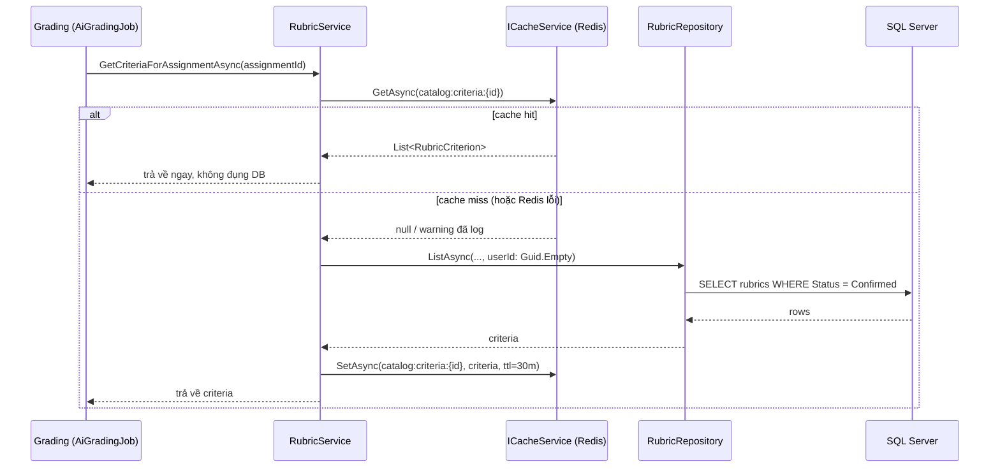

# Redis Caching từ số 0 — áp vào chính code của bạn

Tài liệu này giải thích Redis caching từ khái niệm nền tảng, dùng làm tài liệu thuyết trình cho
tính năng cache-aside vừa thêm vào Catalog service. Mọi ví dụ code đều trích trực tiếp từ repo,
không phải code mẫu.

Liên quan: `docs/gRPC.md` (tính năng gRPC mà cache này tăng tốc), `docs/ARCHITECTURE.md`,
`plans/catalog-grpc-redis-cache/plan.md`, `plans/catalog-grpc-redis-cache/spec.md`.

---

## 1. Vấn đề, trước khi nói tới giải pháp

Grading gọi 2 RPC của Catalog liên tục trong lúc chấm bài: `GetAssignment` (lấy đề bài) và
`GetCriteriaForAssignment` (lấy tiêu chí chấm điểm — rubric). Mỗi bài nộp được chấm là 1 lần gọi.
Một lớp 40 sinh viên, mỗi người nộp 1 bài → 40 lần Catalog phải query SQL Server để lấy **y hệt
cùng 1 dòng dữ liệu**, vì assignment và rubric đã `Confirmed` gần như không đổi trong suốt kỳ chấm.

Đây là dữ liệu **đọc nhiều, ghi hiếm** — đúng bài toán caching giải quyết: giữ 1 bản sao dữ liệu ở
nơi đọc nhanh hơn (bộ nhớ Redis, tính bằng mili-giây) thay vì query lại nơi đọc chậm hơn (SQL Server
qua network, tính bằng chục mili-giây) mỗi lần.

| | Không cache | Có cache (cache-aside) |
|---|---|---|
| Lần đọc thứ 1 | Query SQL Server | Query SQL Server + lưu vào Redis |
| Lần đọc thứ 2, 3, 4... | Query SQL Server (lặp lại) | Đọc thẳng từ Redis, **không đụng SQL Server** |
| Khi dữ liệu đổi (ghi) | Không vấn đề gì — luôn đọc mới nhất | Phải chủ động xoá cache, nếu không sẽ đọc data cũ |
| Rủi ro mới | Không có | Redis chết → phải có đường lùi, không được crash |

Dòng cuối là lý do phần lớn code trong tính năng này không nằm ở "đọc/ghi Redis" (2 dòng gọi
`StackExchange.Redis`), mà nằm ở xử lý 2 hệ quả của việc thêm 1 tầng lưu trữ mới: **dữ liệu cũ đi**
và **tầng đó có thể chết**.

---

## 2. Cache-aside — đọc và ghi đi 2 đường khác nhau

**Cache-aside** (hay "lazy loading") là pattern caching phổ biến nhất: ứng dụng tự quản lý cache,
không phải database tự động cache cho ứng dụng.

- **Đọc**: hỏi cache trước → có (**hit**) thì trả về luôn, không đụng DB → không có (**miss**) thì
  hỏi DB, rồi ghi kết quả vào cache trước khi trả về, để lần sau là hit.
- **Ghi**: cập nhật DB xong → **xoá** key cache tương ứng (không cập nhật cache trực tiếp). Lần đọc
  kế tiếp sẽ miss và tự nạp lại bản mới nhất từ DB.

Chọn "xoá" thay vì "cập nhật cache song song với DB" là quyết định có chủ đích: cập nhật 2 nơi cùng
lúc dễ lệch nhau nếu 1 trong 2 lệnh thất bại giữa chừng; xoá thì đơn giản hơn — cache chỉ có 2 trạng
thái, "có, và đúng" hoặc "không có" — không bao giờ có trạng thái "có, nhưng có thể sai".

---

## 3. `ICacheService` — vì sao không dùng thẳng `IDistributedCache` có sẵn của .NET

.NET có sẵn `IDistributedCache` — cũng support Redis qua `Microsoft.Extensions.Caching.StackExchangeRedis`.
Repo này không dùng thẳng nó, mà bọc 1 interface riêng:

```csharp
// ICacheService.cs
public interface ICacheService
{
    Task<T?> GetAsync<T>(string key, CancellationToken cancellationToken = default);
    Task SetAsync<T>(string key, T value, TimeSpan ttl, CancellationToken cancellationToken = default);
    Task RemoveAsync(string key, CancellationToken cancellationToken = default);
}
```

Lý do: `IDistributedCache` chỉ làm việc với `byte[]` — muốn lưu 1 object (`Assignment`,
`List<RubricCriterion>`) vẫn phải tự serialize/deserialize JSON ở **mọi nơi gọi**. `ICacheService`
generic hoá việc đó (`GetAsync<T>`/`SetAsync<T>`) — nơi gọi chỉ cần biết kiểu dữ liệu, không cần biết
JSON nằm ở đâu. Interface tự viết cũng tách rời code nghiệp vụ khỏi `StackExchange.Redis` cụ thể —
đúng lý do REST/gRPC trong repo này luôn đi qua 1 interface (`ICatalogApiClient`,
`IAssignmentRepository`...) thay vì gọi thẳng thư viện ngoài.

---

## 4. `RedisCacheService` — implementation thật, và cách đăng ký DI

```csharp
// RedisCacheService.cs
public sealed class RedisCacheService(IConnectionMultiplexer multiplexer) : ICacheService
{
    public async Task<T?> GetAsync<T>(string key, CancellationToken cancellationToken = default)
    {
        var db = multiplexer.GetDatabase();
        var value = await db.StringGetAsync(key);
        return value.IsNullOrEmpty ? default : JsonSerializer.Deserialize<T>(value!);
    }

    public async Task SetAsync<T>(string key, T value, TimeSpan ttl, CancellationToken cancellationToken = default)
    {
        var db = multiplexer.GetDatabase();
        await db.StringSetAsync(key, JsonSerializer.Serialize(value), ttl);
    }

    public async Task RemoveAsync(string key, CancellationToken cancellationToken = default)
    {
        var db = multiplexer.GetDatabase();
        await db.KeyDeleteAsync(key);
    }
}
```

`multiplexer.GetDatabase()` được gọi **lại mỗi lần**, không lưu `IDatabase` làm field. `IDatabase`
chỉ là 1 handle rẻ tiền (không mở connection mới); còn `IConnectionMultiplexer` mới là thứ giữ kết
nối thật và tự động reconnect khi mạng chập chờn — giữ `IDatabase` cũ có thể trỏ vào 1 kết nối đã
chết mà multiplexer đã âm thầm thay thế.

Đăng ký DI — `IConnectionMultiplexer` là singleton dùng chung cho cả app, tạo 1 lần lúc khởi động:

```csharp
// ServiceCollectionExtensions.cs
public static IServiceCollection AddCacheService(this IServiceCollection services, IConfiguration configuration)
{
    services.Configure<RedisCacheOptions>(configuration.GetSection(RedisCacheOptions.SectionName));

    services.AddSingleton<IConnectionMultiplexer>(sp =>
    {
        var options = sp.GetRequiredService<IOptions<RedisCacheOptions>>().Value;
        var configurationOptions = ConfigurationOptions.Parse(options.ConnectionString);
        configurationOptions.AbortOnConnectFail = false;

        return ConnectionMultiplexer.Connect(configurationOptions);
    });
    services.AddSingleton<ICacheService, RedisCacheService>();

    return services;
}
```

`AbortOnConnectFail = false` là dòng quan trọng nhất ở đây: mặc định, nếu Redis không kết nối được
lúc khởi động, `ConnectionMultiplexer.Connect` **ném exception và app không start được**. Tắt cờ này
đi để Redis trở thành **hạ tầng tuỳ chọn** (best-effort) chứ không phải hard dependency — Catalog vẫn
phải chạy được kể cả khi container Redis chưa lên kịp hoặc đang restart, vì mọi thứ vẫn hoạt động
đúng (chỉ chậm hơn) nếu quay về đọc thẳng SQL Server.

---

## 5. Đọc — cache-aside qua `GetOrSetAsync`

Logic "hỏi cache trước, miss thì hỏi nguồn thật, rồi ghi lại cache" chỉ viết **1 lần** thành 1
extension method dùng chung cho mọi nơi cần đọc có cache:

```csharp
// CacheServiceExtensions.cs
public static async Task<T> GetOrSetAsync<T>(
    this ICacheService cache, ILogger logger, string key, TimeSpan ttl,
    Func<CancellationToken, Task<T>> factory, CancellationToken cancellationToken = default)
{
    T? cached = default;
    try { cached = await cache.GetAsync<T>(key, cancellationToken); }
    catch (Exception ex) { logger.LogWarning(ex, "Cache read failed for key {CacheKey}; falling back to source.", key); }

    if (cached is not null) return cached;

    var value = await factory(cancellationToken);
    if (value is not null)
    {
        try { await cache.SetAsync(key, value, ttl, cancellationToken); }
        catch (Exception ex) { logger.LogWarning(ex, "Cache write failed for key {CacheKey}.", key); }
    }
    return value;
}
```

`factory` là "cách lấy dữ liệu thật nếu cache miss" — chính là query DB cũ, không đổi gì. 2 nơi gọi
extension method này:

```csharp
// AssignmentService.cs
public Task<Assignment?> GetByIdAsync(Guid id, CancellationToken cancellationToken) =>
    cache.GetOrSetAsync(logger, CacheKeys.Assignment(id), CacheKeys.DefaultTtl,
        ct => repo.GetByIdAsync(id, ct), cancellationToken);
```

```csharp
// RubricService.cs
public Task<List<RubricCriterion>> GetCriteriaForAssignmentAsync(Guid assignmentId, CancellationToken cancellationToken) =>
    cache.GetOrSetAsync(logger, CacheKeys.Criteria(assignmentId), CacheKeys.DefaultTtl,
        async ct =>
        {
            var rubrics = await repo.ListAsync(subjectId: null, assignmentId, userId: Guid.Empty, isAdmin: false, ct);
            return rubrics.FirstOrDefault()?.Criteria ?? [];
        },
        cancellationToken);
```

`repo.GetByIdAsync`/`repo.ListAsync` **không hề biết** có cache tồn tại — service layer là nơi duy
nhất quyết định "endpoint nào được cache", repository chỉ còn đúng việc của nó: query DB.

---

## 6. Ghi — xoá cache qua `InvalidateAsync`

```csharp
// CacheServiceExtensions.cs
public static async Task InvalidateAsync(
    this ICacheService cache, ILogger logger, string key, CancellationToken cancellationToken = default)
{
    logger.LogInformation("Invalidating cache key {CacheKey}.", key);
    try { await cache.RemoveAsync(key, cancellationToken); }
    catch (Exception ex) { logger.LogWarning(ex, "Cache invalidation failed for key {CacheKey}.", key); }
}
```

Gọi ngay **sau** `SaveChangesAsync` thành công, ở mọi đường ghi:

```csharp
// AssignmentRepository.cs
public async Task<Assignment> CreateAsync(Assignment assignment, CancellationToken cancellationToken)
{
    db.Assignments.Add(assignment);
    await db.SaveChangesAsync(cancellationToken);
    await cache.InvalidateAsync(logger, CacheKeys.Assignment(assignment.Id), cancellationToken);
    return assignment;
}
```

```csharp
// RubricRepository.cs — Confirm/Unlock/UpdateCriteria đều đi qua 1 helper chung
private async Task<Rubric> SaveAndInvalidateAsync(Rubric rubric, CancellationToken cancellationToken)
{
    await TrySaveChangesAsync(rubric.Id, cancellationToken);
    await InvalidateCriteriaAsync(rubric, cancellationToken);
    return rubric;
}
```

Cả 2 phía đọc và ghi đều build key cache qua cùng 1 chỗ — `CacheKeys.cs` — để không bao giờ lệch
format giữa nơi ghi cache và nơi xoá cache:

```csharp
// CacheKeys.cs
internal static class CacheKeys
{
    public static readonly TimeSpan DefaultTtl = TimeSpan.FromMinutes(30);
    public static string Assignment(Guid assignmentId) => $"catalog:assignment:{assignmentId}";
    public static string Criteria(Guid assignmentId) => $"catalog:criteria:{assignmentId}";
}
```

---

## 7. Bài toán bảo mật riêng của cache-aside: key không được chứa danh tính người gọi

`GetCriteriaForAssignmentAsync` xưa nay nhận thêm `userId`/`isAdmin` để lọc: rubric `Draft` chỉ
lecturer sở hữu mới thấy được, rubric `Confirmed` thì ai cũng thấy. Vấn đề: **cache không biết ai
đang hỏi**. Nếu cache theo key `catalog:criteria:{assignmentId}` mà response lại phụ thuộc
`userId`, thì lần đầu lecturer A gọi sẽ cache **đúng bản của A** — lần sau lecturer B gọi cùng
`assignmentId` sẽ nhận nhầm **bản đã cache của A**, có thể là rubric `Draft` mà B không có quyền
xem.

Cách sửa không phải "cache theo từng user" (tốn bộ nhớ, hit rate thấp — mỗi user 1 bản cache riêng
của cùng 1 dữ liệu), mà là bắt cache key ép method này chỉ được trả về **1 bản duy nhất, an toàn
cho mọi người gọi**:

```csharp
// RubricService.cs — userId: Guid.Empty là sentinel, không lecturer thật nào có Id này
var rubrics = await repo.ListAsync(subjectId: null, assignmentId, userId: Guid.Empty, isAdmin: false, ct);
```

`Guid.Empty` không phải "không có user" (`null`) — `null` vẫn khớp với `LecturerId == null` của
rubric `SchoolWide` chưa có lecturer nhận, nên vẫn lộ `Draft`. `Guid.Empty` là 1 giá trị **không
lecturer thật nào có** (Identity luôn cấp `Guid.NewGuid()`), nên filter
`Status == Confirmed || LecturerId == userId` chắc chắn thu hẹp về đúng "chỉ `Confirmed`" — bản duy
nhất an toàn để cache chung cho tất cả.

Lớp phòng thủ thứ 2 nằm ở gRPC service: RPC này giờ khoá lại chỉ cho service gọi, không cho end-user
gọi trực tiếp — thu hẹp bề mặt lộ dữ liệu xuống mức tối thiểu:

```csharp
// CatalogGrpcService.cs
[Authorize(Roles = "service")]
public override async Task<GetCriteriaForAssignmentReply> GetCriteriaForAssignment(...)
```

Bài học chung: thêm cache-aside vào 1 endpoint đang có logic phân quyền theo caller **buộc** phải
xét lại — hoặc bỏ hẳn phần phân quyền động đó ra khỏi vùng được cache (như ở đây), hoặc đưa danh
tính caller vào chính cache key (`catalog:criteria:{assignmentId}:{userId}`) — đánh đổi lấy hit rate
thấp hơn hẳn.

---

## 8. Redis chết thì sao? (FR-05 — resilience)

Mọi lệnh gọi `ICacheService` trong `GetOrSetAsync`/`InvalidateAsync` đều nằm trong `try/catch` riêng,
chỉ `LogWarning` rồi tiếp tục — **không bao giờ** để lỗi cache văng lên caller. Hệ quả cụ thể theo
từng tình huống:

| Redis | Đọc (`GetOrSetAsync`) | Ghi (`InvalidateAsync`) |
|---|---|---|
| Sống, có data | Trả từ cache, không đụng DB | Xoá cache, request vẫn thành công |
| Sống, miss | Query DB, rồi cố ghi vào cache | — |
| Chết/timeout | Log warning, tự động query DB như chưa từng có cache | Log warning, request **vẫn** thành công — DB đã ghi xong trước đó rồi |

Có test riêng khẳng định đúng hành vi này:

```csharp
// RubricServiceTests.cs
[Fact]
public async Task GetCriteriaForAssignmentAsync_CacheUnavailable_FallsBackToDb()
{
    cache.ThrowOnAccess = true; // giả lập Redis chết
    var result = await service.GetCriteriaForAssignmentAsync(assignmentId, CancellationToken.None);
    Assert.Single(result); // vẫn ra đúng data, từ DB
}
```

Nguyên tắc: cache là **tối ưu hoá**, không phải **nguồn sự thật**. DB luôn là nguồn sự thật; Redis
chết chỉ làm chậm lại, không bao giờ làm sai hay làm gãy request.

---

## 9. TTL — lưới an toàn cuối, phòng khi quên invalidate

```csharp
public static readonly TimeSpan DefaultTtl = TimeSpan.FromMinutes(30);
```

Xoá cache chủ động ở mọi đường ghi (mục 6) là cơ chế chính giữ dữ liệu luôn mới. TTL 30 phút là lớp
phòng thủ thứ 2, phòng trường hợp tương lai có thêm 1 đường ghi mới (migration script, thao tác admin
trực tiếp trên DB...) mà quên gọi `InvalidateAsync` — dữ liệu cũ trong cache **tự hết hạn** sau tối
đa 30 phút thay vì tồn tại mãi mãi. Không dùng TTL làm cơ chế chính (ví dụ TTL vài giây) vì hit rate
sẽ thấp đi nhiều mà không cần thiết — invalidation chủ động đã đủ chính xác cho phần lớn trường hợp.

---

## 10. Docker Compose — Redis chạy thật trong hệ thống

```yaml
redis:
  image: redis:7-alpine
  healthcheck:
    test: ["CMD", "redis-cli", "ping"]
    interval: 10s
    timeout: 5s
    retries: 10
    start_period: 10s
  networks: [autograding-net]
```

```yaml
# catalog-api service
environment:
  Redis__ConnectionString: redis:6379
depends_on:
  redis: { condition: service_started }
```

`redis:6379` — tên service Docker Compose, không phải `localhost`, vì Catalog gọi Redis qua network
nội bộ `autograding-net` giữa các container, giống hệt cách nó gọi `sqlserver`/`rabbitmq`. Không
map port ra host (không có `ports:`) — Redis không cần truy cập từ ngoài Docker, giảm bề mặt tấn
công so với các service khác đang expose port ra host.

---

## 11. Toàn bộ luồng, xâu chuỗi lại



```
appsettings.json (Redis__ConnectionString)
   │
   ├── AddCacheService()  →  IConnectionMultiplexer (singleton, AbortOnConnectFail=false)
   │                      →  ICacheService = RedisCacheService
   │
   ├── Đọc: AssignmentService / RubricService
   │        gọi cache.GetOrSetAsync(...) — hit trả thẳng, miss thì gọi Repository rồi ghi lại cache
   │
   └── Ghi: AssignmentRepository / RubricRepository
            SaveChangesAsync() xong → cache.InvalidateAsync(CacheKeys.xxx(id))
            (mọi try/catch quanh Redis đều log+swallow — Redis chết không bao giờ fail request)
```

---

## 12. Tóm tắt 1 câu (nếu thầy chỉ hỏi 1 câu)

> Catalog cache 2 loại dữ liệu đọc-nhiều-ghi-hiếm (assignment, rubric criteria) vào Redis theo
> pattern cache-aside: đọc thì hỏi cache trước — miss mới đụng SQL Server rồi ghi lại cache; ghi thì
> xoá key cache tương ứng ngay sau khi DB lưu thành công, có TTL 30 phút làm lưới an toàn dự phòng;
> mọi thao tác Redis đều được log rồi nuốt lỗi nếu thất bại, nên Redis chết chỉ làm chậm lại chứ
> không bao giờ làm gãy request — và vì cache dùng chung cho mọi người gọi, endpoint tiêu chí chấm
> điểm phải bỏ hẳn phần lọc theo quyền lecturer ra khỏi vùng được cache, chỉ cache đúng 1 bản
> `Confirmed`-only an toàn cho tất cả.
